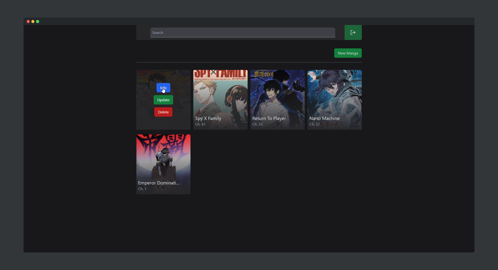

<span align="center">
<h1>Manga Collector</h1>
<p>v1.0.0</p>
</span>

Simple mono project written in Go, HTML, CSS and TypeScript (NextJS) where you can
manage your manga's. 



<br />

## Usage

```bash
# clone project
git clone https://github.com/ReaperMaga/manga-collector.git
```

```bash
# run production build
$ docker-compose up -d
```

<hr />
Other useful commands:

```bash
# run production build (with rebuild in case of new changes)
$ docker-compose up -d --build

# view docker logs
$ docker-compose logs -t -f

# close docker process
$ docker-compose down
```

<br /> <hr/>

## Configuration

To the change password and other configuration options open the `docker-compose.yml` file and edit them there.

<br /> <hr/>


## Licensing

Distributed under the MIT License. See [LICENSE](LICENSE) for more information.
